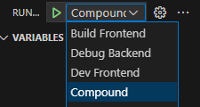

# template-axum-svelte

이 Repository는 Axum과 Svelte를 사용하여 중소형 웹 풀스택 환경을 구축하는 템플릿입니다.

## 설치 및 사용법

### VSCode의 `Run and Debug`를 이용한 방법

VSCode를 이용할 경우, Repository에 포함된 `Compound` launch.json을 통해 즉시 디버깅 및 실행할 수 있습니다.

> Repository를 받은 후 즉시 실행할 경우 `backend` 및 `frontend`에 필요한 종속성 항목들을 install 하는 작업이 있으므로 실행까지 속도가 다소 느릴 수 있습니다.



이미지를 참고하여 `Compound`를 실행시키면 아래와 같은 웹 서비스 환경이 실행됩니다.

- [http://localhost:3000](http://localhost:3000) (Axum 웹 서비스)
- [http://localhost:5173](http://localhost:5173) (Vite 웹 서비스)

> `localhost:3000`과 `localhost:5173` 모두 웹 페이지를 볼 수 있지만, `localhost:3000`의 웹 페이지는 `frontend`에서 작업한 웹 프레임워크의 빌드된 결과를 표기하므로 브라우저를 통한 디버깅이 어려울 수 있습니다. `frontend` 영역에 대한 디버깅이 필요하다면 `localhost:5173`으로 접근하시기 바랍니다.

### 명령어를 통한 방법

CLI 환경에서 직접 처리하고 싶을 경우 아래 순서로 실행하세요.

1. `frontend` 에서 npm i 실행
  ```sh
  npm i
  ```

2. `frontend`에서 `npm run build` 실행 (선택)

  Axum 서버 환경을 통해 웹페이지를 보고 싶을 경우, `frontend` 디렉토리에서 아래 명령어를 실행하세요. Repository를 처음 clone 한 후 1번 단계 없이 바로 다음 단계 실행 뒤, `localhost:3000` 서비스에 접근하면 웹페이지가 표기되지 않습니다.
  ```sh
  npm run build
  ```

3. 프로젝트 폴더에서 `cargo run` 실행

  ```sh
  cargo run
  ```

4. `frontend`에서 `npm run dev` 실행

  ```sh
  npm run dev
  ```